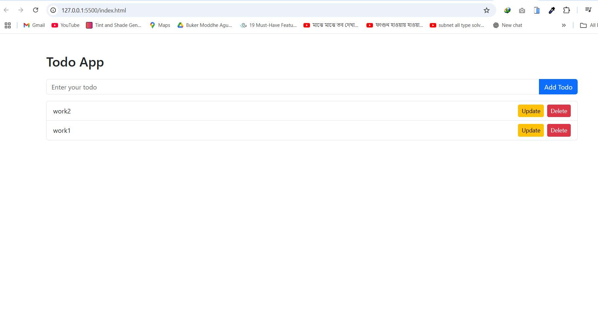

# Todo App - Module 11 Project

This is a basic Todo App built using **HTML**, **CSS (Bootstrap)**, and **Vanilla JavaScript**.

---

## Screenshot

Below is a screenshot of the Todo App interface:

## Features

- Add todos
- Delete todos
- Render todos dynamically
- Update todos (using prompt)
- Used required Bootstrap classes:  
  `list-group-item d-flex justify-content-between align-items-center`

---

## Important Notes

- The structure of `index.html` has not been modified
- No extra features have been added
- Submitted via **GitHub** repository (not ZIP) to avoid penalties

---

## Author

Nowshin Eza  
